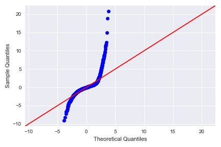
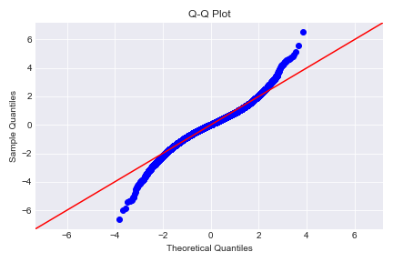
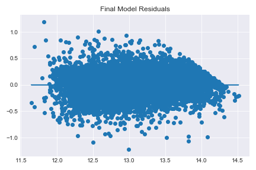

# King County House Sales Linear Regression
Linear Regression Modeling on King County House Sales data

### Group Members
- Andrew Muller
- Asher Khan

## Business Case
We will predict how much a house should be sold for in order to determine whether a house on the market is being underpriced or overpriced. Our clients are homeowners looking to sell their house, but do not know how much to sell their house for.

## Data Analysis
We were given information on the column in the column_names.md file. After turning all the data into numerical data types, we handle any NaN values and create a few new features: 'yr_since_renovation', 'yr_since_built', and 'renovated'. We then drop unneeded features: 'view', 'sqft_above', 'sqft_living15', 'sqft_lot15', and 'date'.

With the data cleaned, we start to analyze it. Scatter plots of each variable against our target, price, show which of our variables have obvious linear relationships. Insignificant relationships will be taken care of when we start looking at the p-values of our coefficients, so they don't need to be handled now. This also makes clearer which variables are categorical and which are continuous.

Histograms show us that none of our variables are normally distributed. None of them are, so we will need to log transform them later.

We look at colinear features using a heatmap and decide to remove the 'yr_built', 'yr_renovated', 'price', 'yr_sold', and 'yr_since_renovation' columns.

## Model
Our baseline model had the following metrics:
- R2 of 0.821
- adjusted R2 of 0.820
- Train RMSE of 157156
- Test RMSE of 139700
- 81 significant features (p-value < 0.05)
- 103 features total

To improve on our model, we took the following steps:
- dropped colinear features ()
- removed outliers from our datasets
- log transformed applicable continuous features
- eliminated insignificant features (p-value < 0.05)

Our final model has the following metrics:
- R2 of 0.857
- adjusted R2 of 0.856
- Train RMSE of 103086
- Test RMSE of 99701
- 90 significant features (p-value < 0.05)
- 90 features total

We also performed cross-validation and constructed a residuals plot to verify that our final model is accurate.

## Conclusions

- each bedroom decreases the sale price of a house by 5%
- each bathroom increases the sale price of a house by 6%
- a 1% change in square footage living area increases the sale price of a house by .48%
- a 1% change in square footage lot area increases the sale price of a house by .07%
- if the house is on the waterfront, the sale price of a house increases by 60%
- a 1% change in square footage basement area decreases the sale price of a house by .00005%
- if you move north, a 1 degree increase in latitude increases the sale price of a house by 65%
- if you move east, a 1 degree increase in longitude decreases the sale price of a house by 53%
- a 1-year increase in the age of a house increases its sale price by .04%
- a house that has been renovated has its sale price increased by 6%
- using a one-floor house as a baseline, a 1.5-floor house has its price increased by 1.5%, while a 3-floor house has its price decreased by 6.4%. Other numbers of floors are approximately equal in price to a 1-floor house.
- using a condition of 1 as a baseline, a condition of 2 increases the price by 19%, a condition of 3 increases the price of a house by 31%, a condition of 4 increases the price by 35%, and a condition of 5 increases the price by 40%

Our model could be improved in the future by adding interactive features, polynomial features, and map data.

Our final model will be useful in predicting sale prices of houses in King county. We can use these predictions to help our clients set the prices for their houses, and find houses that are currently underpriced.
